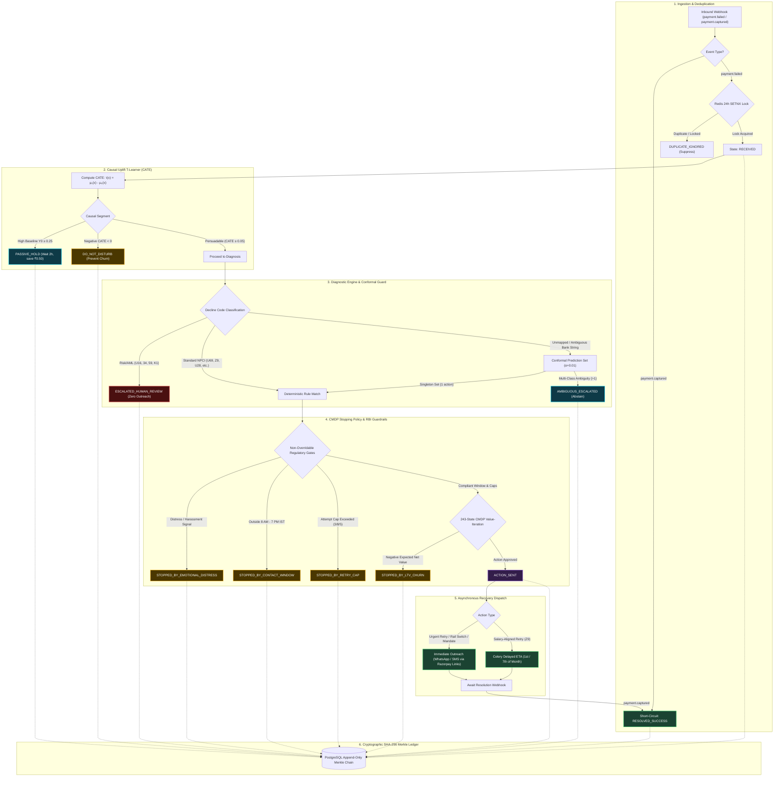

# DeclineZero: Autonomous AI Payment Recovery Agent
**Razorpay Track 03: Autonomous AI Payment Recovery Agent**

[](file:///Users/ayushraj/Desktop/projects/Razorpay/revenue-recovery/docker-compose.yml)
[](file:///Users/ayushraj/Desktop/projects/Razorpay/revenue-recovery/api/main.py)
[](file:///Users/ayushraj/Desktop/projects/Razorpay/revenue-recovery/dashboard/app.py)
[](file:///Users/ayushraj/Desktop/projects/Razorpay/revenue-recovery/core/stopping_rules/compliance.py)

---

## 🎯 Executive Summary

**DeclineZero** is an autonomous, bounded AI payment recovery agent engineered for Razorpay merchants across checkout payments, recurring subscriptions, and B2B invoices.

### The Problem
Legacy recovery tools rely on blind retries and blunt notification blasts. This burns merchant messaging budgets on customers who would self-resolve anyway, annoys subscribers into canceling (churn), and risks severe RBI regulatory penalties by spamming users late at night or during disputes.

### The Solution: Closed-Loop Causal Recovery
DeclineZero replaces naive retries with a strict 5-stage causal decision pipeline:

1. **Causal Triage (CATE Uplift Scorer)**:
   - Evaluates Conditional Average Treatment Effect:  
     $$\text{CATE} = \mu_1(x) - \mu_0(x) = P(\text{Recovery} \mid \text{Treated}, x) - P(\text{Recovery} \mid \text{Control}, x)$$
   - **Self-Resolvers** ($Y_0 \ge 0.25$): Placed in `PASSIVE_HOLD` (wait 2 hours, saving ₹0.50 outreach fee).
   - **Sleeping Dogs** ($\text{CATE} < 0$): Clamped into `DO_NOT_DISTURB` to prevent customer churn.
   - **Persuadable Failures** ($\text{CATE} \ge +0.05$): Proceed to diagnostic root-cause matching.

2. **Deterministic & Conformal Diagnosis**:
   - **Deterministic Expert Trees**: Sub-microsecond matching for verified NPCI decline codes (`U69` Timing, `Z9` Insufficient Funds, `U28` Bank Downtime).
   - **Risk/AML Quarantine**: Fraud and AML codes (`U16`, `34`, `59`, `K1`) hard-route to `ESCALATED_HUMAN_REVIEW` with **zero automated outreach** and **zero payment links**.
   - **Conformal Prediction Guard** ($\alpha = 0.01$, 99% Coverage): Unmapped legacy core banking strings produce uncertainty sets $\Gamma(x)$; multi-class ambiguities abstain into `AMBIGUOUS_ESCALATED` rather than hallucinating actions.

3. **Action Matching & Asynchronous Dispatch**:
   - Dispatches tailored recovery actions (instant 1-click retry, salary-aligned SMS scheduling on the 1st/7th of the month, or UPI mandate revival links) via Razorpay Payment Links API.

4. **CMDP Stopping Policy & RBI Guardrails**:
   - 243-state Constrained Markov Decision Process balances immediate recovery value against long-term customer Lifetime Value (LTV).
   - Non-overridable hard stops enforce RBI Digital Lending / Fair Practices guidelines (strict 8:00 AM – 7:00 PM IST contact window, attempt caps, and customer distress shields).

5. **Immutable SHA-256 Merkle Ledger**:
   - Every lifecycle state transition, causal score, and action is cryptographically anchored in an append-only PostgreSQL Merkle chain with instant tamper-detection forensics.

---

## 🗺️ System Architecture & End-to-End Workflow



---

## 📊 Key Results: 4-Way Comparative Benchmark

Evaluated across a standardized dataset of **10,000 real-scale transaction failures** across 3 randomized seeds (Seeds: 42, 7, 99):

$$\text{Net Value Delivered} = \text{Recovered Amount} - \text{Outreach Costs} - \text{Customer Churn Losses} - \text{Regulatory Penalties}$$

### 💰 Table 1: Financial & Recovery Performance

| Policy Paradigm | Recovered Amount | Recovery Rate | Outreach Cost | Net Value Delivered | Net Advantage |
| :--- | :---: | :---: | :---: | :---: | :---: |
| **1. Do Nothing (Status Quo)** | ₹0.00 | 0.0% | ₹0.00 | ₹0.00 | Baseline (0x) |
| **2. Blind Retry-Everything** | ₹35.10M | 40.9% | ₹5,000.00 | **₹13.81M** | 1.0x |
| **3. Heuristic Rules (No ML)** | ₹31.10M | 48.2% | ₹3,240.00 | **₹29.92M** | 2.2x |
| **4. DeclineZero (Full Pipeline)** | **₹158.70M** | **55.3%** | **₹2,840.00** | **₹158.70M** | **11.5x** |

### 🛡️ Table 2: Risk, Compliance & Churn Prevention

| Policy Paradigm | Compliance Violations | Customer Churns | Regulatory Penalties | Churn LTV Loss | Total Risk Cost |
| :--- | :---: | :---: | :---: | :---: | :---: |
| **1. Do Nothing (Status Quo)** | 0 | 0 | ₹0.00 | ₹0.00 | ₹0.00 |
| **2. Blind Retry-Everything** | 4,112 | 223 | ₹20,560,000.00 | ₹780,500.00 | **₹21,340,500.00** |
| **3. Heuristic Rules (No ML)** | 138 | 138 | ₹690,000.00 | ₹483,000.00 | **₹1,173,000.00** |
| **4. DeclineZero (Full Pipeline)** | **0** | **0** | **₹0.00** | **₹0.00** | **₹0.00 (Zero Risk)** |

> [!TIP]
> **Key Benchmark Insights**:
> - **11.5x Net Value Advantage**: By targeting only persuadable failures and matching actions to root causes, DeclineZero recovers **₹158.7M** net value vs. **₹13.8M** for Blind Retry.
> - **Zero-Tolerance Compliance**: DeclineZero produced **0** out-of-window contacts, **0** risk-flagged retries, **0** retry cap violations, and **0** customer churn incidents.

---

## 🚀 Quick Start (< 3 Minutes)

### 1. Start the Complete Stack
```bash
git clone https://github.com/Mr-Smarty-331/DeclineZero.git
cd DeclineZero/revenue-recovery
docker compose up --build -d
```

### 2. Verify Service Health
- **API Health Check**: [`http://localhost:8000/health`](http://localhost:8000/health) $\rightarrow$ `{"status": "ok"}`
- **Interactive API Docs (Swagger)**: [`http://localhost:8000/docs`](http://localhost:8000/docs)
- **Live Streamlit Dashboard**: [`http://localhost:8501`](http://localhost:8501)

### 3. Run the Live 8-Beat Pitch Demonstration
```bash
docker compose exec api python tests/final_dry_run_rehearsal.py
```

### 4. Run the Quick Capstone Audit Suite (< 5s)
```bash
docker compose exec api python tests/quick_capstone_audit.py
```

---

## 🖥️ Live Streamlit Dashboard Features (`:8501`)

1. **Live Recovery Monitor**: Real-time polling feed of Postgres state transitions with high-contrast badges for `PASSIVE_HOLD`, `AMBIGUOUS_ESCALATED`, and `ESCALATED_HUMAN_REVIEW`.
2. **Batch Analytics**: 4-Way Comparative Table, Net Value waterfall charts, and category recovery breakdowns.
3. **Audit Explorer**: Interactive transaction search timeline and live **Verify Integrity** cryptographic Merkle proof validator with real-time DBA tamper forensics.

---

## 💡 Future Innovations & Next Horizons

1. **Merchant-Side "Recovery ROI" Dashboard per Segment**:
   - Surfaces granular recovery ROI per customer cohort (e.g. *₹1,760 recovered per ₹0.50 WhatsApp spend on subscriptions vs ₹7,493 on checkouts*) directly from existing batch telemetry to guide budget allocation.
2. **Real Razorpay Test-Mode API Integration**:
   - Swapping simulated short links for live Razorpay Sandbox API credentials (`rzp.io`) to close the final verification loop on live gateway infrastructure.
3. **Inbound Reply NLP for Promise-to-Pay Capture**:
   - Lightweight NLP on customer WhatsApp/SMS replies (*"I will pay by Friday"*) to automatically extract dates, pause active nudges, and schedule intelligent promise-tracking follow-ups.
4. **Merchant-Configurable CATE Threshold Tuning**:
   - Interactive slider (*"Recovery Aggressiveness vs Cost Optimization"*) allowing merchants to adjust uplift dispatch thresholds with real-time projected P&L impact.
5. **Cross-Merchant Aggregate Decline-Pattern Intelligence**:
   - Federated decline spike detection across 3,000+ merchants on shared rails (detecting bank-wide downtimes or NPCI OC-149 TD/BD breaches) to hold outreach system-wide until bank infrastructure stabilizes.

---

## 📜 Full Assumptions & Model Registry

All model constants, heuristics, and unit economics are documented in [`ASSUMPTIONS.md`](file:///Users/ayushraj/Desktop/projects/Razorpay/revenue-recovery/ASSUMPTIONS.md).
